---

### 🚀 **About Me**

- 🛠️ **DevOps/SRE Engineer with 10+ years building resilient systems at scale**
- ☁️ **Multi-cloud expertise (AWS, GCP, Azure) with infrastructure-as-code focus**
- 🔥 **Strong believer in "CI/CD or it didn't happen"**
- 🎯 **Passionate about observability, automation, and zero-downtime deployments**
- 🎮 **Currently getting insided on Rust**

### 🛠️ **Tech Stack**

---

### 📊 **Languages in My Public Repositories**

  

---

### 🤝 **Connect With Me**

  

